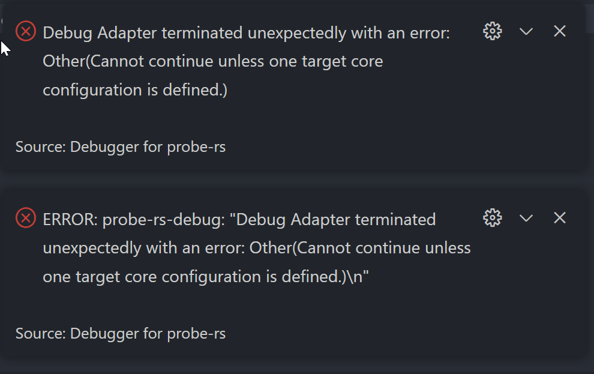

# Probe-rs issue

## Test setup:

Debugger: JLINK Plus V11
JLink Driver Version V7.66
MCU: stm32wb55rg 

## Test procedure:

- Add breakpoint to Line 24 `counter += 1;`
- Start debugging

## Expected behavior:

- Breakpoint should work 
- Continue should work and the breakpoint should trigger again in the next loop iteration

## Behavior:
### probe-rs 0.27.0 (git commit: 7d59a31)

Debugger crashes



Debug Log Output
```
FLASHING: Starting write of "D:\\Software\\embedded-test-issue\\target/thumbv7em-none-eabihf/debug/minimal-firmware" to device memory
FLASHING: Completed write of "D:\\Software\\embedded-test-issue\\target/thumbv7em-none-eabihf/debug/minimal-firmware" to device memory
probe-rs-debug: RTT Window opened, and ready to receive RTT data on channel 0
ERROR: probe-rs-debug: "Debug Adapter terminated unexpectedly with an error: Other(Cannot continue unless one target core configuration is defined.)\n"
 WARN probe_rs::session:833: Could not clear all hardware breakpoints: An ARM specific error occurred.

Caused by:
    0: The debug probe encountered an error.
    1: An error which is specific to the debug probe in use occurred.
    2: A USB transport error occurred.
    3: timed out
 WARN probe_rs::session:845: Failed to deconfigure device during shutdown: Arm(Probe(ProbeSpecific(BoxedProbeError(Usb(Kind(TimedOut))))))
probe-rs-debug: Session ended: Cannot continue unless one target core configuration is defined.
probe-rs-debug: DAP Protocol server exiting

probe-rs-debug: Closing probe-rs debug session
```

### probe-rs 0.26.0 (git commit: e92fd37)
Does not work either.

Debug Log Output
```
probe-rs-debug: Log output for "probe_rs=warn" will be written to the Debug Console.
probe-rs-debug: Starting probe-rs as a DAP Protocol server
probe-rs-debug: Listening for requests on port 56284
probe-rs-debug: Starting debug session from: 127.0.0.1:56286
FLASHING: Starting write of "D:\\Software\\embedded-test-issue\\target/thumbv7em-none-eabihf/debug/minimal-firmware" to device memory
FLASHING: Completed write of "D:\\Software\\embedded-test-issue\\target/thumbv7em-none-eabihf/debug/minimal-firmware" to device memory
probe-rs-debug: RTT Window reused, and ready to receive RTT data on channel 0
ERROR: probe-rs-debug: "Debug Adapter terminated unexpectedly with an error: Other(Cannot continue unless one target core configuration is defined.)\n"
 WARN probe_rs::session:832: Could not clear all hardware breakpoints: An ARM specific error occurred.

Caused by:
    0: The debug probe encountered an error.
    1: An error which is specific to the debug probe in use occurred.
    2: A USB transport error occurred.
    3: timed out
 WARN probe_rs::session:844: Failed to deconfigure device during shutdown: Arm(Probe(ProbeSpecific(BoxedProbeError(Usb(Kind(TimedOut))))))
probe-rs-debug: Session ended: Cannot continue unless one target core configuration is defined.
probe-rs-debug: DAP Protocol server exiting

probe-rs-debug: Closing probe-rs debug session
```

### probe-rs 0.25.0 (git commit: 0b989aa)
Works as expected
